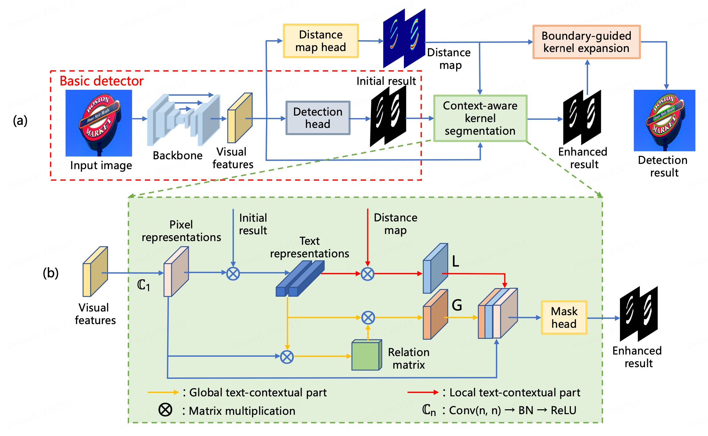

# [CBNet: A Plug-and-Play Network for Segmentation-based Scene Text Detection](https://link.springer.com/article/10.1007/s11263-024-02022-w)
Official PyTorch implementation of "CBNet: A Plug-and-Play Network for Segmentation-based Scene Text Detection" in International Journal of Computer Vision (IJCV) 2024.



## News
- (2024/03/21)  Code is released.

## Installation

First, clone the repository locally:

```shell
git clone https://github.com/XiiZhao/cbn.pytorch
```

Then, install PyTorch 1.4.0+, torchvision 0.5.0+, and other requirements:

```shell
conda install pytorch torchvision -c pytorch
pip install -r requirement.txt
```

Finally, for CPP type codes of post-processing:

```shell
# build cpp boundary-guided algorithms
cd models/post_processing/bg/
# prepare packages (e.g. pybind11, clipper), set Makefile and compile
make -j12
```

## Dataset
Please refer to [dataset/README.md](dataset/README.md) for dataset preparation.

## Training
```shell
CUDA_VISIBLE_DEVICES=0,1,2,3 python train.py ${CONFIG_FILE}
```
For example:
```shell
CUDA_VISIBLE_DEVICES=0,1,2,3 python train.py config/cbn/cbn_r18_ctw.py
```

## Testing

### Evaluate the performance

```shell
# single model type:
python test.py ${CONFIG_FILE} ${CHECKPOINT_FILE}
cd eval/
./eval_{DATASET}.sh

# batch modle type:
1) save all model path to a file (e.g. ctw_model.list)
2) sh batchEval.sh ctw_model.list
```
For example:
```shell
python test.py config/cbn/cbn_r18_ctw.py checkpoints/cbn_r18_ctw/checkpoint.pth.tar
cd eval/
./eval_ctw.sh
```

### Evaluate the speed

```shell script
python test.py ${CONFIG_FILE} ${CHECKPOINT_FILE} --report_speed
```
For example:
```shell script
python test.py config/cbn/cbn_r18_ctw.py checkpoints/cbn_r18_ctw/checkpoint.pth.tar --report_speed
```

## Acknowledgement
This repository is built using the [PAN](https://github.com/whai362/pan_pp.pytorch) repository, thanks their wonderful work.


## Citation

If you find our work is useful for your research, please kindly cite our paper.

```
@article{zhao2024cbnet,
  title={CBNet: A Plug-and-Play Network for Segmentation-based Scene Text Detection},
  author={Zhao, Xi and Feng, Wei and Zhang, Zheng and Lv, Jingjing and Zhu, Xin and Lin, Zhangang and Hu, Jinghe and Shao, Jingping},
  journal={International Journal of Computer Vision},
  pages={1--20},
  year={2024},
  publisher={Springer}
}
```

## Contact

If you have any questions, you can submit your issue in this repository, or contact me from the email: xizhao24@yeah.net
